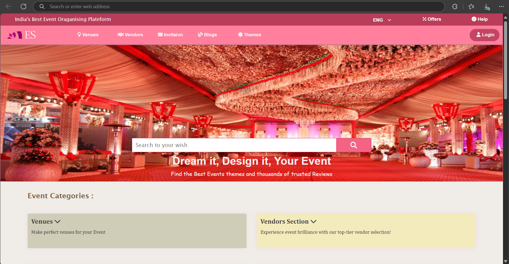
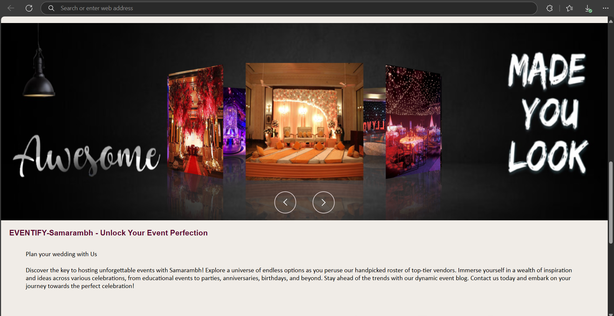
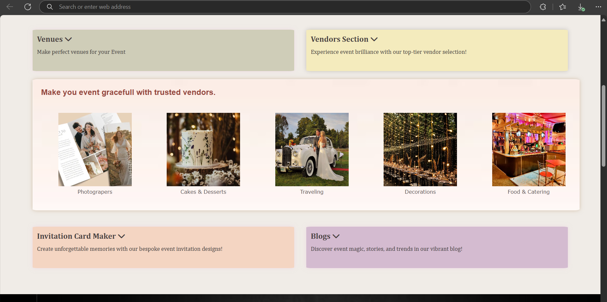

<h1>Eventify Samarambh (FRONTEND) 🎉</h1>
Welcome to Eventify Samarambh – a vibrant and engaging front-end event planning website designed to bring events to life!  Built using HTML, CSS, and a touch of JavaScript, this project focuses on creating a visually appealing and interactive user experience.

<h3>✨ What makes it special?</h3> 
🎨 Stunning UI: A colorful gradient theme with elegant textures that make every page pop.
📱 Responsive Design: Works smoothly on all devices, whether you're on a laptop, tablet, or phone.
⚡ Interactive Elements: JavaScript adds a bit of magic to enhance the user experience.
🏆 Explore & Plan Events: Find venues, vendors, invitations, themes, and more – all in one place.
 
This is a front-end-only project, but it's packed with creativity and attention to detail, making it an exciting showcase of event planning aesthetics. Whether you're a developer looking for inspiration or someone who loves great web design, Eventify Samarambh is worth exploring! 🚀
  
🔗 Live Demo (if available): https://eventify-samarambh.netlify.app/
📌 Built with: HTML | CSS | JavaScript

## **✨ Preview**  
  
  
  
*A beautifully designed event planning website with colorful gradients and smooth textures.*  
